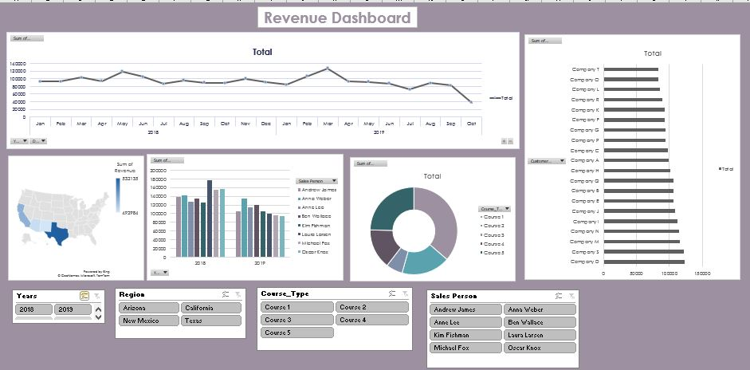

# Revenue_Dashboard

## Objective 
Analysing the performance of a hypothetical company selling courses worldwide

## Process 
Analysis is done on the following parameters
-Total sales per month in terms of revenue
-Total sales by region
-Sales by employee
-Course share
-Customer/Company spending 

